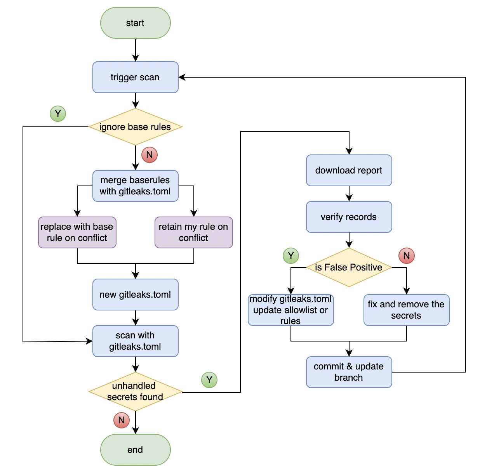

# gitleaks
[](https://github.com/aloong-actions/gitleaks/actions/workflows/ci.yml)

This github action is used to scan secrets in your repository with [gitleaks](https://github.com/zricethezav/gitleaks). Gitleaks is a SAST tool for detecting and preventing hardcoded secrets like passwords, api keys, and tokens in git repos.

**Why using a new search engine instead of git-secrets or detect-secrets?**

Git-secrets is no longer maintained on a regular basis and have too many FPs.

Detect-secrets is the backend engine of Snowden scan written in python but have significant performance issues on scanning.

Gitleaks is written in golang and have more modern search methods. It also support scanning the history of the repository.

## Input Variables

| Name | Required | Description |
|---|---|---|
| token | false | GitHub Access Token |
| version | false | gitleaks tool version, default: '8.8.4' |
| config | false | gitleaks config file path to the repo's root path, default: '.gitleaks.toml' |
| rule-merge-mode | false | The policy applied to the customized config file and base rules.<br/>      **options**: (replace/retain/ignore) (default retain)<br/>&nbsp;&nbsp;&nbsp;&nbsp;**replace**:  merge base rules with customized rules, replace the rule of customized file if the rule id is same in the two files;<br/>&nbsp;&nbsp;&nbsp;&nbsp;**retain:**   merge base rules with customized rules, retain the rule of customized file if the rule id is same in the two files;<br/>&nbsp;&nbsp;&nbsp;&nbsp;**ignore:**   don't apply the base rules, use the tool's default rules.<br/> |
| format | false | report format (json, csv, sarif) (default "csv") |
| report-file-prefix | false | filename: `<report-file-prefix>-<reponame>-<runid>.<format>` |

Customize your action behavior by changing the values specified above.

> :warning:**Note**:
> If you use organization level secrets, and your repository is `PUBLIC`, make sure the org level secrets's `Repository access` property is set to `All repositories`, otherwise the action could not read the secrets.

## Example usage

.github/workflows/scan-secrets.yml

```yaml
name: Secret Scan

on: [ push, pull_request ]

jobs:
  build:
    runs-on: [ ebf-pod-ubuntu-2004-slim ]
    steps:
        # must checkout first
      - name: Checkout
        uses: actions/checkout@v3
      - uses: actions/setup-node@v3
        with:
          node-version: '16'
      - name: Scan Secrets
        uses: actions/gitleaks@v1
```

Add `.gitleaks.toml` in the root of your repository. You may copy the config under  `sample/.gitleaks.toml` in this repo as your baseline. If your have specified `config` in your action(for example: `config: gitleaks/.gitleaks.toml`), make the file consistent with your specification.

## How it works



1. download gitleaks by your specified version;
2. determine how to handle the rule file, retain or merge rule files on selection;
3. scan the branch with gitleaks;
4. genenrate the report file, if leaks detected, upload the report file.


### How to handle the secrets issues

1. download the report file, check the records. The secrets are scanned by commits;
2. if the record is FP, you can update your `.gitleaks.toml` by either:
   * add the filename of your record in `allowlist.paths`
   * figure out the regex of your FP, add it in `allowlist.regexes`

**example:**
```toml
[allowlist]
description = "global allow lists"
regexes = [
    '''.*\.svc\.ilb''',       # the secrets met '*.svc.ilb' will be excluded
    '''secretsalt => .*''',   # the secrets met 'secretsalt => .*' will be excluded
    ]
paths = [                     # files in the list will be ignored
    '''index.js.map''',
    '''rpt.csv''',
    '''gitleaks.toml''',
    '''dist/.*.js''',
    '''.secrets.baseline''',
    '''(.*?)(jpg|gif|doc|pdf|bin|svg|socket)$''',
    '''(go.mod|go.sum)$''',
    '''(?i)readme.md''',
]
```

```toml
[[rules]]
description = "Generic API Key"
id = "generic-api-key"
regex = '''(?i)(?:key|token|pat[^ht]|secret|password|pwd|passwd|auth)(?:[0-9a-z\-_\s.]{0,20})(?:[\s|']|[\s|"]){0,3}(?:=|>|:=|\|\|:|<=|=>|:)(?:'|\"|\s|=|\x60){0,5}([0-9a-z\-_.=]{2,})(?:['|\"|\n|\r|\s|\x60]|$)'''
secretGroup = 1
entropy = 3.5
keywords = [
    "key","api","token","secret","pat","password","auth",
]
[rules.allowlist] # customized allowlist by regex
regexes = [
  '''(?i)__[0-9a-z\-_]*__'''
]
```

For further usage, please refer to the [official guideline](https://github.com/zricethezav/gitleaks#usage).


## Contributing

We welcome contributions. See [how to contribute](./CONTRIBUTING.md).
